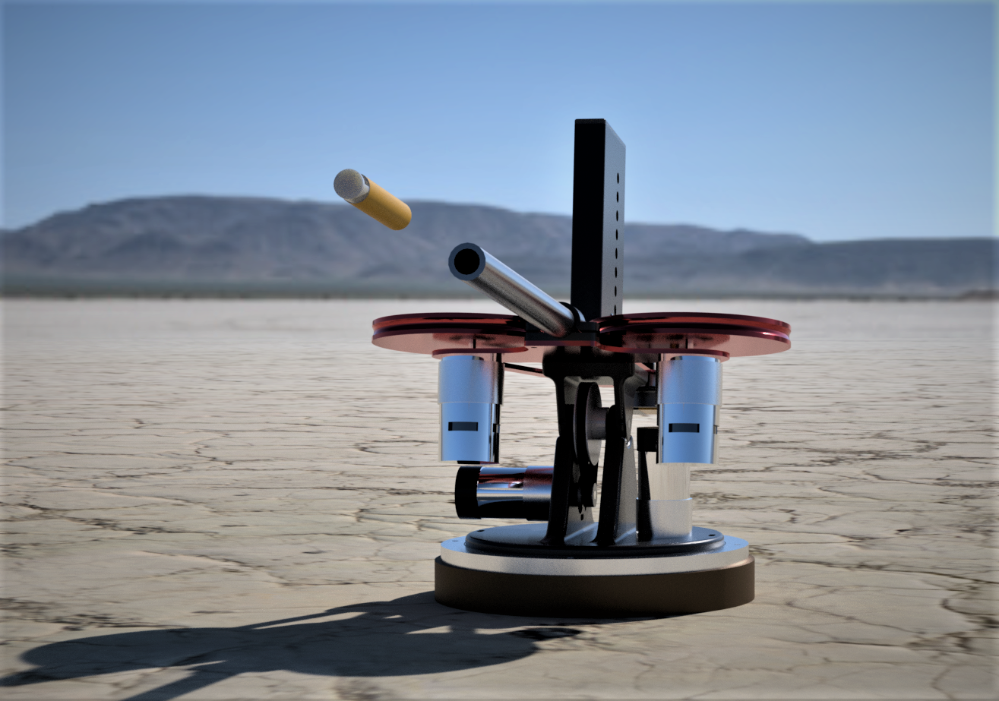

# Overview - Learn by Dueling

Thomas Taylor

Dylan Weiglein

Jonathan Fraser

Cal Poly, San Luis Obispo

Winter Quarter 2023

ME-405 Term Project

Thank you to Professor John R. Ridgely for the project. It was a great experience.

This project was a showcase of all programming and hardware skills acquired over the last two quarters of our Mechatronics education. The goal of the project was to integrate motor control, sensors, communication protocols, and inspire creativity with an open-ended design.

The competition goal was to create a machine that uses a thermal camera to direct a nerf dart to an opponent in the shortest amount of time. The rules were simple - each time has five seconds to rotate their machine from rear facing to front facing, acquire a target, and ten seconds to fire. The first team to land a hit scored three points, the second team to hit scored one point, any misses subtracted a point, and any subsequent hits did not affect the score.

This exercise is an early study on the possibility of targetting embers falling through the sky and precisely extinguishing them before they have a chance to cause further wildfire damage. In theory, a network of these machines that use thermal data for targetting can prevent the spread of fires.

# Hardware
## Mechanical

The machine is actuated by two 200rpm 24v encoded motors to control rotation and pitch. With an internal gearing of 50:1 and an external gearing of 4:1, the machine is able to rotate about either axis at 1 revolution per second. Two 24v 12,000rpm motors with 5" diameter flywheels enthusiastically send darts down a lightweight 12" aluminum barrel. A maximum of 12 Nerf Accustrike darts are fed from a factory magazine, which are pushed into the path of the flywheels by a 25kg 180deg hobby servo linked by pin and slot mechanism to a custom machined 3/8" firing rod. A custom 3D printed receiver supports the magazine, firing rod, and rear of the barrel. 

The support structure is a combination of laser cut 12g steel and 3D printed pivot mechanisms. The base of the machine rotates on an 8" lazy Susan ball bearing unit. It is bolted to a bespoke wooden base with adequate clearance for the yaw gearing. This is further supported by a brake disc to prevent slipping and under-rotation of the turret. 

## Electronics

All electronics are secured to a custom 3D printed electronics control box. They are powered by a 24V 15A power supply with an emergency stop and 15A fuse. This is stepped down to provide 7.9V to the hobby servo and 5V to the control logic, encoders, and LEDs. 

The 24V motors are powered by two Dual L298 DC Motor drivers. A limit switch on a tether is used as a "start" button to signal the machine to start a new round. A Melexis MLX90640 thermal camera mounted to the barrel provides machine vision.

To add to the overall aesthetic of the design, a 3.3-24V alarm and three 5V pre-resisted red LEDs alert the opponent of their approaching fate.

Our microcontroller is an STM32 L476RG running MicroPython.

# Software

Our software utilizes I2C communication to retrieve images from the infrared camera. The captured images are then processed using a targeting algorithm to detect human targets. Once a target has been detected, a PID control algorithm is employed to control the encoder motors, which are used to fire a Nerf dart accurately towards our target. 

In competition, the idling system waits for the "Go" signal from the user switch. Upon detection, it:
- Starts a master timer
- Rotates 180 degrees to face the opponent
- Once five seconds has passed (both teams freeze), capture a thermal image
- Process the most likely location for a human's center of mass
- Send a correction in yaw and pitch to the motors and allows for 0.25s of movement
- Fires a single shot
- Returns "home"

The targeting algorithm was refined over many test sessions. Once data is captured, the algorithm:
- Checks a specified range of columns and sums the heat values above a threshold level
- Looks for the largest value in the largest summed row

We were getting unreliable data from a weighted average system. Although we had mostly successful hits, occasionally the turret would aim a bit too high (face level) which was tougher to hit than chest level.

Detailed software information can be found in our [repository](https://github.com/tomhorizon/405FinalProject).

# Results

## Testing

Testing took a significant amount of time as we fine-tuned the machine. Some of the issues we ran in to were:

- The firing pin. We made small adjustments to ensure it had a consistent and reliable range of motion, which was achieved by using a servo and linkage mechanism. 
- The flywheels had issues with drawing too much current on startup. We had to ensure that they propelled the dart straight towards the target and did not draw too much current, which could affect the system's overall performance. We had one issue with the early press-fit flywheels (before flange mounting) where the system abruptly came to full power and a flywheel came off. One monitor and one keyboard were damaged beyond repair.
- The pitch and yaw movement were tested to verify that the system was capable of accurately aiming the Nerf dart towards the target. We found issues in the gearing system where, over time, the gears could creep out of place. Reinforcements were made to the yaw large gear and an idler was added to the pitch belt.
- The accuracy of the targeting algorithm was also tested to ensure that it correctly identified and tracked human targets, further enhancing the precision of the system. We ended up fine-tuning our algorithm with small offsets to pitch and yaw to ensure it more frequently hit our human targets.

## Performance

The competition took place over two days. Unfortunately, the first day went poorly and we missed all five of our bouts with our first opponent. The turret mostly shot left by a few degrees, missing entirely. The frustration was compounded by the fact that the turret hit consistently in testing before, and after, the match.

On the second day of competition, the turret performed with striking accuracy with no change in code. It is possible that it was a cooler day and there was less thermal noise in the background. 

## Final Product Pictures

## Takeaways

Overall, building our own system rather than relying on pre-existing Nerf hardware was a success, as it allowed us to create a more intricate and finished design. We also had ample time to put into the project, which allowed us to thoroughly test each subsystem and the system as a whole, which was critical in identifying issues and debugging them. 

However, certain algorithms, such as the weighted average for targeting, did not work as well as we had hoped. Along with this, pure proportional control with a single fixed setpoint caused constant overshooting, which affected the accuracy of the system. Additionally, the vibrations from the flywheels caused issues with the overall stability of the system and led to certain other systems failing or becoming unreliable.

For anyone interested in continuing our research, we recommend using a higher resolution thermal camera and a faster processing unit. A major drawback of the system was the ability to distinguish a human at a range of sixteen feet. The quickest we were able to pull an image was 0.480s - a faster processor would allow for real-time tracking and firing before the five second "freeze" mark.

# Links

**Videos (YouTube)**

[1: Compilation of championship day (3/17/2023)](https://youtu.be/L2fNEF87ndI)

[2: Close-up view of operation](https://youtu.be/JrsSzEOzaZ4)

**Purchases**

***Mechanical***

[Ball Bearing Base](https://www.amazon.com/dp/B07T2C6VDH?psc=1&ref=ppx_yo2ov_dt_b_product_details)

[Pivot Bearings](https://www.amazon.com/dp/B082PSMWXD?psc=1&ref=ppx_yo2ov_dt_b_product_details)

[Pulley Sets](https://www.amazon.com/dp/B0BKLFHRTP?psc=1&ref=ppx_yo2ov_dt_b_product_details)

[24v Encoded Motors](https://www.amazon.com/gp/product/B08ZT3S38L/ref=ppx_yo_dt_b_asin_title_o03_s00?ie=UTF8&psc=1)

[12,000rpm 24v 775 Motors](https://www.amazon.com/gp/product/B08NTK8JXZ/ref=ppx_yo_dt_b_asin_title_o03_s03?ie=UTF8&psc=1)

[Hobby Servo](https://www.amazon.com/gp/product/B07GJ6ZCVY/ref=ppx_yo_dt_b_asin_title_o03_s03?ie=UTF8&psc=1)

[Nerf Darts](https://www.amazon.com/gp/product/B076JGQP8W/ref=ppx_yo_dt_b_asin_title_o03_s03?ie=UTF8&psc=1)

[D Shaft](https://www.mcmaster.com/8632T132/)

[Barrel](https://www.mcmaster.com/catalog/129/4168/7785T14)

[Flywheel Flanges](https://www.amazon.com/dp/B07PFW6GKL?psc=1&ref=ppx_yo2ov_dt_b_product_details)

***Electrical***

[Power Supply](https://www.amazon.com/gp/product/B06XK2ZNKC/ref=ppx_yo_dt_b_search_asin_title?ie=UTF8&psc=1)

[24v to 7.9v Converter](https://www.amazon.com/dp/B09SB6JLS7?psc=1&ref=ppx_yo2ov_dt_b_product_details)

[24v to 5v Converter](https://www.amazon.com/gp/product/B01M03288J/ref=ppx_yo_dt_b_asin_title_o03_s01?ie=UTF8&psc=1)

[DC Motor Driver](https://www.amazon.com/gp/product/B08FC1851N/ref=ppx_od_dt_b_asin_title_s02?ie=UTF8&psc=1)

[Power Busses](https://www.amazon.com/gp/product/B093PWRJS9/ref=ppx_od_dt_b_asin_title_s03?ie=UTF8&psc=1)

[E-Stop](https://a.co/d/5AqA7yo)

[Pre-wired LEDs](https://www.amazon.com/dp/B07TNHH6ML?psc=1&ref=ppx_yo2ov_dt_b_product_details)

[Buzzer](https://www.amazon.com/dp/B07QBP1W5L?psc=1&ref=ppx_yo2ov_dt_b_product_details)

